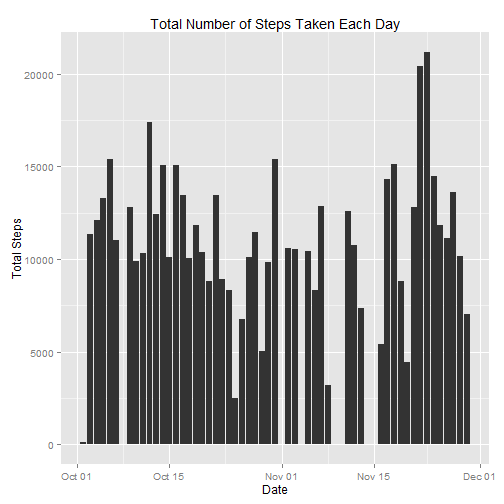
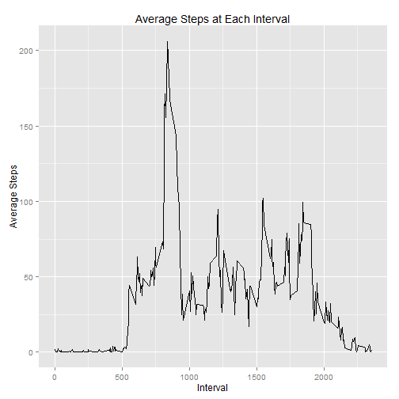
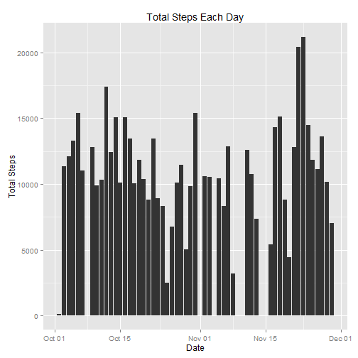
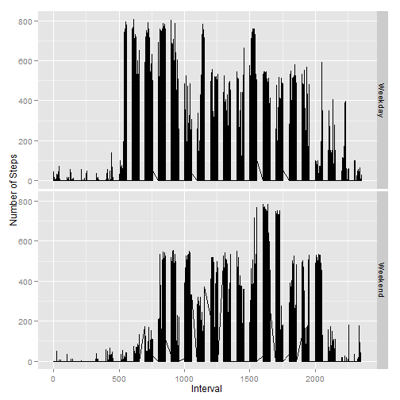

## Loading and preprocessing the data

```r
library(dplyr)
library(ggplot2)
activity <- tbl_df(read.csv("activity.csv")) 

## Remove missing values:
filter(activity, steps != "NA") -> activity.f
#Group the data by date.
group_by(activity.f, date) -> activity.fg
#total the number of steps taken on each day.
summarise(activity.fg, total = sum(steps)) -> act_sum
```
## What is mean total number of steps taken per day?

```r
#Use summarise to find:
summarise(act_sum, Mean = mean(total), Median = median(total))
```

```
## Source: local data frame [1 x 2]
## 
##       Mean Median
## 1 10766.19  10765
```

```r
#The mean is 10766 steps and the median is 10765 steps.

#Histogram
p <- ggplot(data = act_sum, mapping = aes(x = as.Date(date), y = total))

p <- p + layer(geom = "histogram", stat = "identity")

p <- p + labs(title = "Total Number of Steps Taken Each Day", x = "Date", y = "Total Steps") 
p
```

 

## What is the average daily activity pattern?


```r
#Group the data by interval
group_by(activity, interval) -> g_act
#Select the steps column, and find the mean number of steps for each interval.
select(g_act, steps) -> g_act_s

summarise(g_act_s, Mean = mean(steps, na.rm = T)) -> m_act

#create a time series plot:
j <- ggplot(data = m_act, mapping = aes(x = interval, y = Mean))

j <- j + layer(geom = "line")

j <- j + labs(title = "Average Steps at Each Interval", x = "Interval", y = "Average Steps")
j
```

 

```r
#Find and print the row containing the highest mean value:
max(m_act$Mean) -> mmax

which(grepl(mmax, m_act$Mean)) -> m

m_act[m,]
```

```
## Source: local data frame [1 x 2]
## 
##   interval     Mean
## 1      835 206.1698
```

```r
##The highest average number of steps, 206, occurs at 835 minutes.
```
## Imputing missing values

```r
#Extract only those rows containing NA's.
activity[is.na(activity$steps),] -> NAs

# Find the number of NA's:
length(NAs$steps)
```

```
## [1] 2304
```

```r
#My strategy for imputing the values to the dataset is to find the mean for each day 
#that the NA's are in, and replace the NA's with that value.


#group by the date and extract the steps column from the grouped data:
group_by(activity, date) -> gd_act
select(gd_act, steps) -> gd_act_s

#Use summarise to find the mean number of steps taken each day.  
# NaN means the resulting mean is 0, so replace NaN with 0's.
d_act <- summarise(gd_act_s, Mean = mean(steps, na.rm = T))
0 <- d_act$Mean[is.nan(d_act$Mean)]
```

```
## Error in 0 <- d_act$Mean[is.nan(d_act$Mean)]: invalid (do_set) left-hand side to assignment
```

```r
#Replace NA values, with their respective means, which turn out to be 0.
NAmer <- tbl_df(merge(NAs, d_act, by.x = "date", by.y = "date"))
activity2 <- activity
activity2$steps[is.na(activity2$steps)] <- 
  NAmer$Mean[match(activity$steps, NAmer$steps)][is.na(activity$steps)]


activity2_g <- group_by(activity2, date)

#The new data set:
activity2_g
```

```
## Source: local data frame [17,568 x 3]
## Groups: date
## 
##    steps       date interval
## 1    NaN 2012-10-01        0
## 2    NaN 2012-10-01        5
## 3    NaN 2012-10-01       10
## 4    NaN 2012-10-01       15
## 5    NaN 2012-10-01       20
## 6    NaN 2012-10-01       25
## 7    NaN 2012-10-01       30
## 8    NaN 2012-10-01       35
## 9    NaN 2012-10-01       40
## 10   NaN 2012-10-01       45
## ..   ...        ...      ...
```

```r
act2_sum <- summarise(activity2_g, total = sum(steps))
## Plot:

k <- ggplot(data = act2_sum, mapping = aes(x = as.Date(date), y = total))

k + layer(geom = "histogram", stat = "identity") -> k

k + labs(title = "Total Steps Each Day", x = "Date", y = "Total Steps") -> k
k
```

 

```r
##Mean and Median:

summarise(act2_sum, Mean = mean(total), Median = median(total)) 
```

```
## Source: local data frame [1 x 2]
## 
##   Mean Median
## 1  NaN     NA
```

```r
#For the new dataset, the mean and median are lower because the NA values previously not #counted are all 0's.
```

## Are there differences in activity patterns between weekdays and weekends?

```r
#Convert dates to day names:
activity.f$days <- weekdays(as.Date(activity.f$date))

#function for determining and printing whether a day is a weekend or weekday.
sorter <- function(x){
  if (x == "Sunday"|x == "Saturday"){
    return("Weekend")
  }
  else{
    return("Weekday")
  }
}
  #Attach to activity.f df as a column
  activity.f$daytype <- as.character(lapply(activity.f$days, sorter)[1:15264])
  activity.f$daytype <- as.factor(activity.f$daytype)
  q <- ggplot(activity.f,     aes(x = interval, y = steps)) + geom_line() + facet_grid(daytype ~ .) + labs(x = "Interval", y = "Number of Steps")
q
```

 

```r
# Yes, there are differences in activity patterns.  
# Activity seems to occur later in the day on weekends.
```
